# Kubernetes "Demo": Intro to Helm (conclusion); Intro to RBAC

## Goals

* Conclude our helm survey by getting familiar with...
  * Packaging helm charts
  * Using helm repositories
* Survey Kubernetes RBAC (role-based access control)
  * for users, specifically in context of an AWS EKS cluster in our demo example
  * for pods running in the cluster

## Concepts

* [Helm chart repositories](https://helm.sh/docs/topics/chart_repository/)
* [K8s RBAC](https://kubernetes.io/docs/reference/access-authn-authz/rbac/)
  * [Role](https://kubernetes.io/docs/reference/access-authn-authz/authorization/)
  * ClusterRole
  * RoleBinding
  * ClusterRoleBinding
  * [Subjects](https://kubernetes.io/docs/reference/access-authn-authz/rbac/#referring-to-subjects)
    * User or Group
    * [ServiceAccount](https://kubernetes.io/docs/reference/access-authn-authz/service-accounts-admin/)
  * K8s API server [authentication](https://kubernetes.io/docs/reference/access-authn-authz/authentication/) options

## Lab

### 1. Setup

* Follow the updated README in the `todoapi` [here](https://github.com/itt-learning-groups/todoapi/blob/master/build/README.md) to get the demo cluster up and running.

### 2. Helm Survey (concluded)

* Package the helm chart into a compressed archive file

  * Move into the `build/helm/chart_from_scratch` directory (that contains the chart directory) and run `helm package todoapi`:

  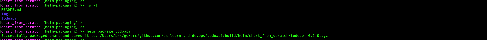

* We currently have our todoapi `dev` environment running.
  It was created by installing the chart directory to the `dev` namespace.
  Let's remove that release and try re-installing using the packaged helm chart:

      helm upgrade --install todoapi ./todoapi-0.1.0.tgz \
        --create-namespace \
        --set 'ingress.hosts.host=todoapi.dev.ittlearninggroups.com' \
        --set 'ingress.tls.hosts={todoapi.dev.ittlearninggroups.com}' \
        --set 'db.name.value=todoapidev' \
        --set "imageCredentials.registry=${DOCKER_SERVER}" \
        --set "imageCredentials.username=${DOCKER_USERNAME}" \
        --set "imageCredentials.password=${DOCKER_PSWD}" \
        --set "imageCredentials.email=${DOCKER_EMAIL}" \
        --set "dbCredentials.dbusername=${DB_USERNAME}" \
        --set "dbCredentials.dbpswd=${DB_PSWD_DEV}" \
        -n dev

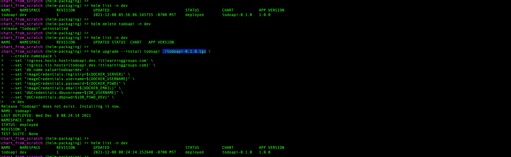

* Create a new directory, e.g. "helm-charts", and move the packaged helm chart to that location.
  We'll use this as a simple [helm chart repository](https://helm.sh/docs/topics/chart_repository/#hosting-chart-repositories).
  Use `helm repo index .` to get helm to auto-generate a [repository index file](https://helm.sh/docs/topics/chart_repository/#the-index-file):

  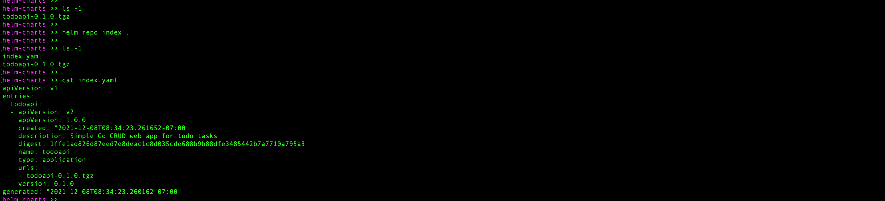

  * We'll push this to a public repo on GitHub:

  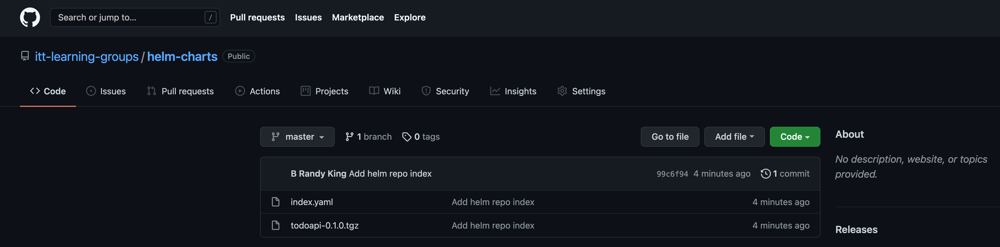

* We can now access both the index file and the helm-chart archive file directly from GitHub, and so can helm:

  * <https://raw.githubusercontent.com/itt-learning-groups/helm-charts/master/index.yaml>

  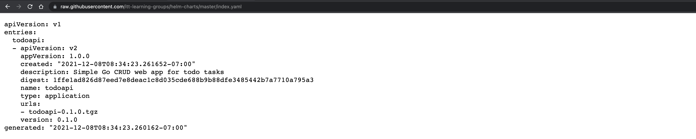

  * <https://github.com/itt-learning-groups/helm-charts/raw/master/todoapi-0.1.0.tgz>

* We currently have our todoapi `qa` environment running.
  It was created by installing the chart directory to the `qa` namespace.
  Let's remove that release and try re-installing using the packaged helm chart:

      helm upgrade --install todoapi "https://github.com/itt-learning-groups/helm-charts/raw/master/todoapi-0.1.0.tgz" \
        --create-namespace \
        --set 'ingress.hosts.host=todoapi.qa.ittlearninggroups.com' \
        --set 'ingress.tls.hosts={todoapi.qa.ittlearninggroups.com}' \
        --set 'db.name.value=todoapiqa' \
        --set "imageCredentials.registry=${DOCKER_SERVER}" \
        --set "imageCredentials.username=${DOCKER_USERNAME}" \
        --set "imageCredentials.password=${DOCKER_PSWD}" \
        --set "imageCredentials.email=${DOCKER_EMAIL}" \
        --set "dbCredentials.dbusername=${DB_USERNAME}" \
        --set "dbCredentials.dbpswd=${DB_PSWD_QA}" \
        -n qa

  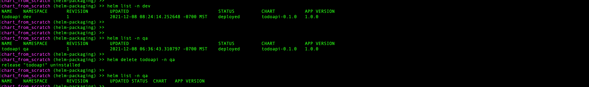

  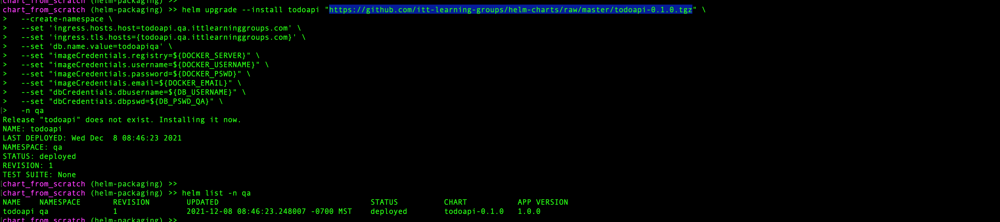

  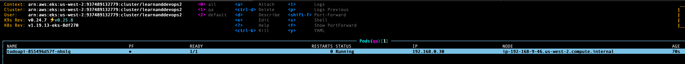

* There is a more sophisticated way to do this, though.
  Helm is intended to be used as a package manager that can work with public/private [remote repositories](https://helm.sh/docs/topics/chart_repository/#the-chart-repository-structure) in a similar sort of way that e.g. Docker works with image repositories (only without the space-saving file layering, though there are [experimental versions of helm repos](https://helm.sh/docs/topics/registries/) that work that way):

  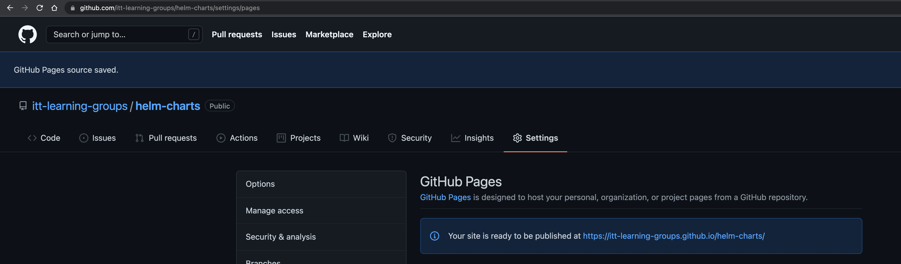

  * We should be able to designate our GitHub file server as a helm repo that can be access remotely from our local helm CLI, and use it to "pull" a version of the archived helm chart:

  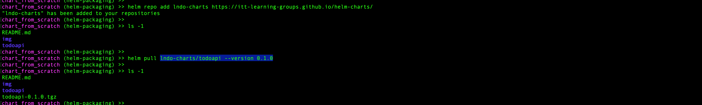

  * We can list our locally-registered helm repositories (i.e. those whose indexes we've downloaded locally so helm know how to "talk" to them), and find the `lnds-charts` among them:

  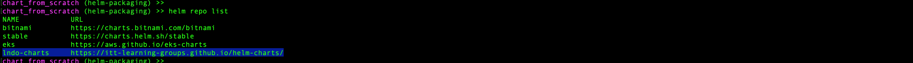

  * And we can even search our remote repositories to see what `todoapi` charts are available:

  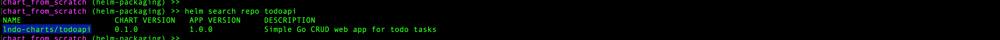

    (Note that other popular publicly-available helm repos include the `stable`, `bitnami`, and `eks` repos that I've added previously to my local helm CLI for other reasons.)

  * We currently have our todoapi `prod` environment running.
    It was created by installing the chart directory to the `prod` namespace.
    Let's remove that release and try re-installing using the remote chart via its `lnds-charts` repository:

        helm upgrade --install todoapi lndo-charts/todoapi \
          --create-namespace \
          --set 'ingress.hosts.host=todoapi.prod.ittlearninggroups.com' \
          --set 'ingress.tls.hosts={todoapi.prod.ittlearninggroups.com}' \
          --set 'db.name.value=todoapiprod' \
          --set "imageCredentials.registry=${DOCKER_SERVER}" \
          --set "imageCredentials.username=${DOCKER_USERNAME}" \
          --set "imageCredentials.password=${DOCKER_PSWD}" \
          --set "imageCredentials.email=${DOCKER_EMAIL}" \
          --set "dbCredentials.dbusername=${DB_USERNAME}" \
          --set "dbCredentials.dbpswd=${DB_PSWD_PROD}" \
          -n prod

  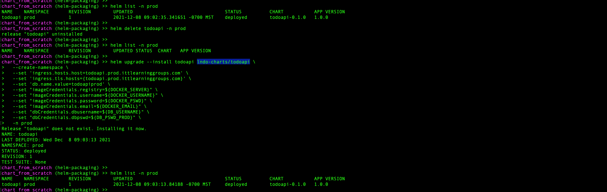

  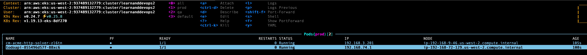

### 3. RBAC I: Setting up IAM-based admin & developer access roles for the cluster

* Create IAM users representing our example admin ("ImanAdmin") and developer ("ImaDeveloper") users.

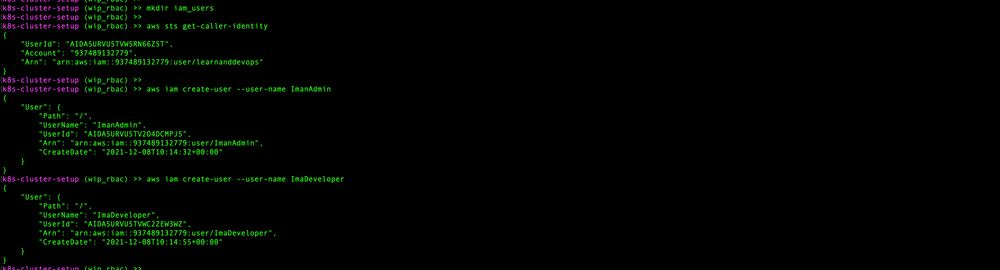

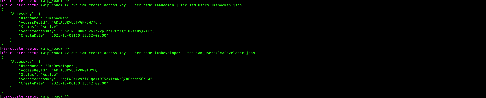

#### Admin user(s)/role/group

* Create an IAM user group for K8s admin users; add "ImanAdmin" to it.

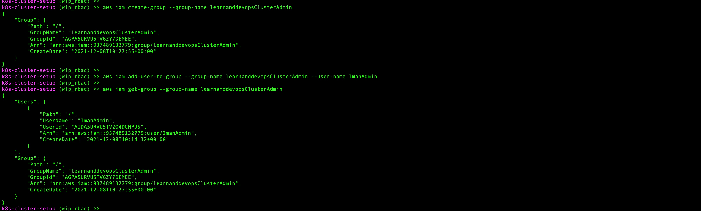

* Create an IAM role for all users (e.g. "ImanAdmin") who will have admin access to the cluster.
  Remember: K8s doesn't manage users. You need to manage your users and user groups outside K8s.
  There are many options. Since we're already using AWS for our (EKS) example cluster here, we'll use AWS IAM to manage our users for this particular example, since that's convenient and secure.

  * We want the IAM role to be "assumeable" by any IAM users in the "learnanddevopsClusterAdmin" group.
    We'll make an assume-role IAM policy for the role that allows users within the group to assume the role.
    (IAM doesn't allow a user group to be assigned as a principal here; we'll need to ammend the principal users when/if new users are added to the cluster admin group in the future.)

    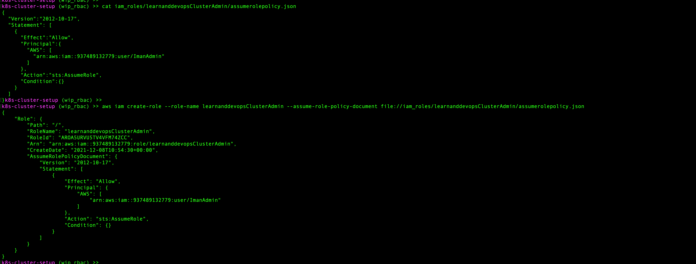

  * Then we'll add a policy to the "learnanddevopsClusterAdmin" group allowing its members specific permission to assume the role.

    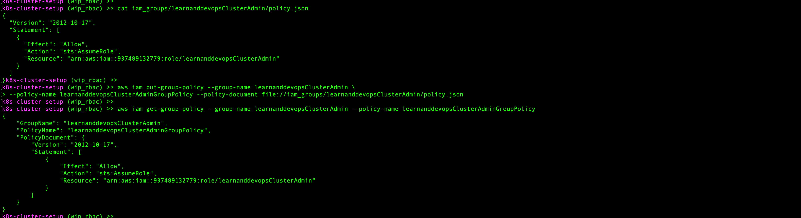

* Register the "learnanddevopsClusterAdmin" IAM role with our EKS cluster's aws-iam-authenticator plugin

  * In order to authenticate externally-managed users with the K8s cluster's API server, your cluster must be configured with an authenticator.
    Here again, there are a number of alternatives.
    In our example, our EKS cluster is already configured with the [aws-iam-authenticator](https://github.com/kubernetes-sigs/aws-iam-authenticator#how-does-it-work), courtesy of our easy `eksctl` cluster setup.
    This authenticator is already running on the cluster's control plane, and it maps IAM roles or users to K8s-internal users via a ConfigMap called `aws-auth` in the `kube-system` namespace.
    There is only one role mapped there so far, which was done by eksctl to enable the NodeInstanceRole that is managing the cluster's EC2 node instances:

    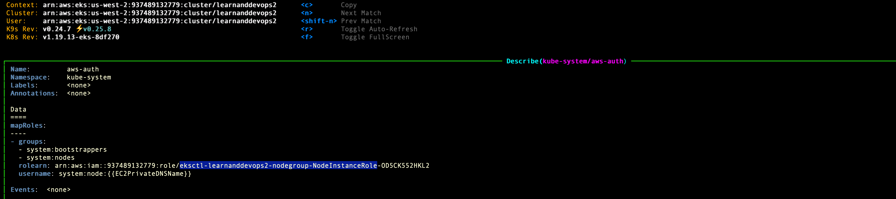

    We could edit this ConfigMap manually, but it's convenient to use `eksctl` for that.
    For this "admin" role, we don't need to create a new K8s Role/ClusterRole and RoleBinding/ClusterRoleBinding.
    Our cluster already has a [convenient `system:masters` group](https://kubernetes.io/docs/reference/access-authn-authz/rbac/#user-facing-roles) bound to the existing `cluser-admin` ClusterRole. We'll re-use that in this case:

    

    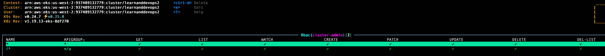

    

    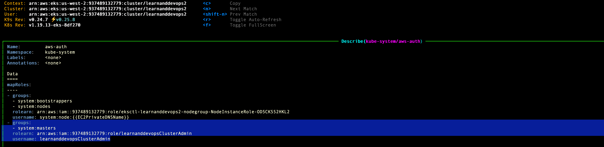

* Create a local AWS profile to capture that new learnanddevopsClusterAdmin IAM role so we can assume it and try it out (as if we were the "ImanAdmin" user):

    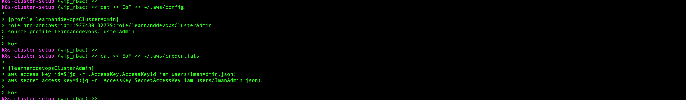

* Update `~/.kube/config` to extend kubectl access for this profile:

    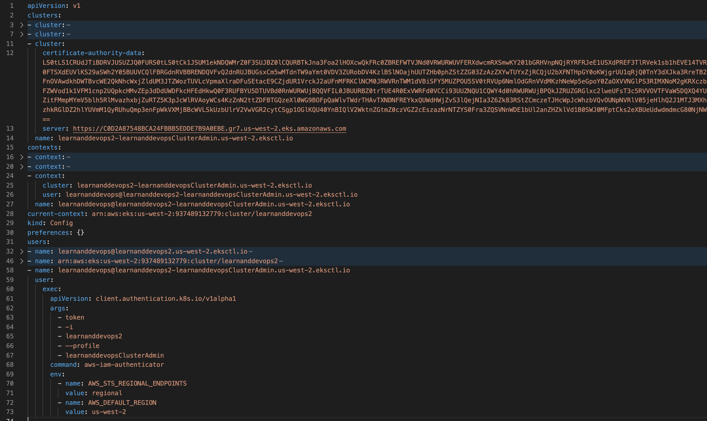

* Assume the AWS profile and use it to manage the cluster, e.g.:

    

#### Developer user(s)/role/group

A lot of this will be the same as for the "Admin" user/role/group.
But instead of using an existing ClusterRole and binding like we did for the "learnanddevopsClusterAdmin", we'll create custom Role and RoleBinding within the `dev` and `qa` namespaces with non-admin permissions.
It would be a good idea to create a 3rd set of user(s)/role/group for more limited, principally read-only access within the `prod` namespace. But we'll leave that as a homework exercise.
The goal is to offer a limited, non-admin set of permissions for ordinary developers to use: Allow them to do their jobs but limit the amount of damage they might be able to do through ignorance, carelessness, or malice.

* Create an IAM user group for K8s developer users; add "ImaDeveloper" to it.

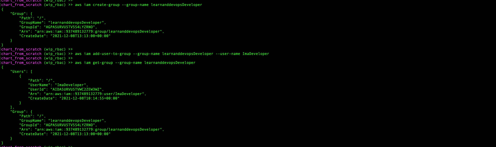

* Create an IAM role for all users (e.g. "ImaDeveloper") who will have developer access to the cluster.

  * We want the IAM role to be "assumeable" by any IAM users in the "learnanddevopsDeveloper" group.
    We'll make an assume-role IAM policy for the role that allows users within the group to assume the role.

    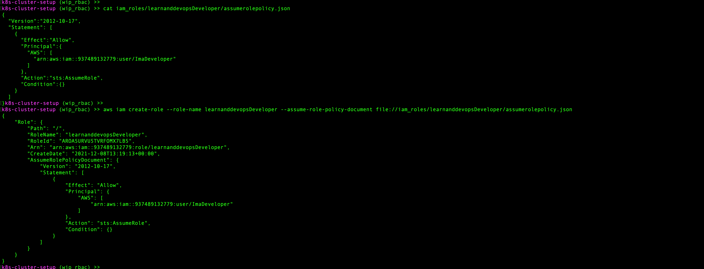

  * Then we'll add a policy to the "learnanddevopsDeveloper" group allowing its members specific permission to assume the role.

    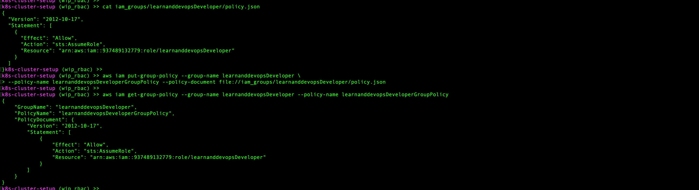

* Create a K8s Role and RoleBinding

    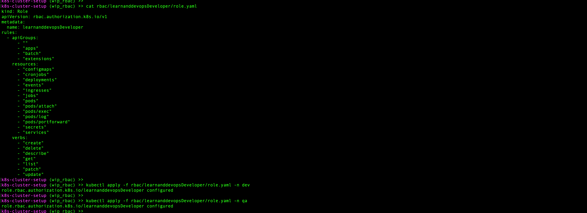

    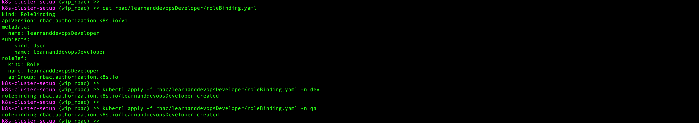

* Register the "learnanddevopsDeveloper" IAM role with our EKS cluster's aws-iam-authenticator plugin

    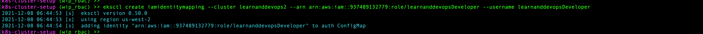

    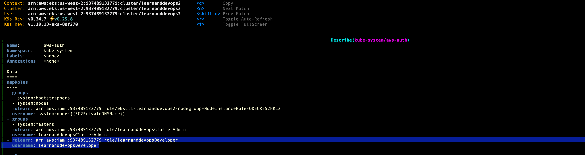

* Create a local AWS profile to capture that new learnanddevopsDeveloper IAM role so we can assume it and try it out (as if we were the "ImaDeveloper" user):

    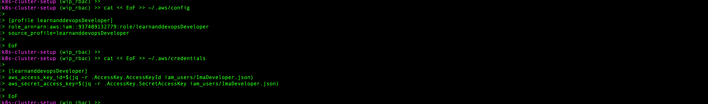

* Update `~/.kube/config` again to extend kubectl access for this profile:

    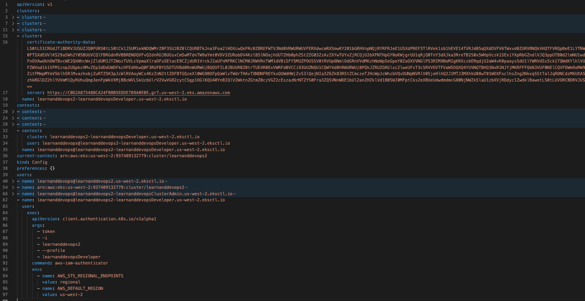

* Assume the AWS profile and use for limited cluster management *within the `dev` or `qa` namespaces*, but not in `prod` (not allowed for this kubectl user), e.g.:

    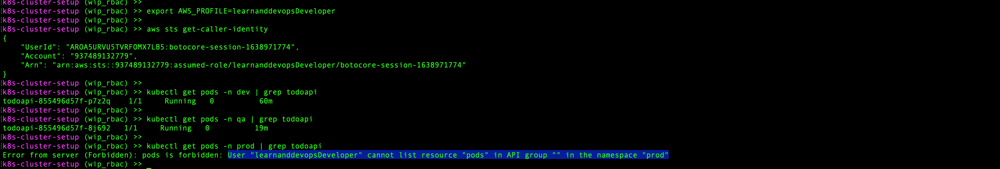

### 4. RBAC II: Setting up ServiceAccount-based role for `todoapi` pods in the cluster

(*Next Week*)
